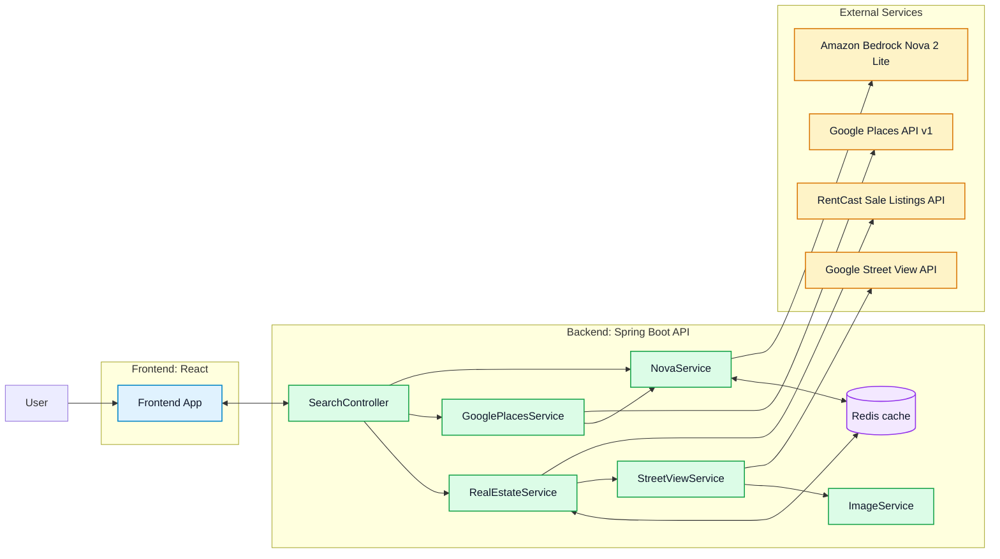

# Dog Park Homes Finder

**Amazon Nova AI Hackathon** — Full-stack app that finds homes for sale **near highly rated dog parks**. Built for the Amazon Nova AI Hackathon; uses **Amazon Nova 2 Lite** (via Bedrock) for natural-language query parsing and dog park review analysis.

- **Frontend**: React + Vite + TypeScript + Google Maps (`@react-google-maps/api`)
- **Backend**: Spring Boot (Java 17) + Redis caching (optional) + Google Places API + RentCast listings + Amazon Bedrock (**Nova 2 Lite**)

## Repo structure

- `frontend/`: Vite app (runs on `http://localhost:5173`)
- `backend/`: Spring Boot API (runs on `http://localhost:8000`)

## How it works (high level)

1. User enters a natural-language prompt in the UI (e.g., “Seattle, walkable parks, under $900k”).
2. Backend calls **Nova 2 Lite** to parse the prompt into structured filters (currently used to extract location).
3. Backend calls **Google Places** to find dog parks in that location, filters by rating, and fetches reviews.
4. Backend calls **Nova 2 Lite** again to score dog park reviews (parking/crowded/cleanliness/etc.). Results are cached.
5. Backend calls **RentCast** for homes-for-sale near the selected dog park(s), and assigns nearest park + distance.
6. Frontend renders results as a list + map, with markers for homes and dog parks.

## Architecture Design



### Request flow

1. The user submits a natural-language housing query in the React app.
2. `frontend/src/api/search.ts` posts that query to `POST /api/search`.
3. `SearchController` asks `NovaService` to extract structured search filters, especially location and radius.
4. `GooglePlacesService` searches for dog parks, fetches reviews for the top rated parks, and calls `NovaService` again to score review quality dimensions.
5. `RealEstateService` loops through the selected parks, queries RentCast for nearby sale listings, and assigns nearest-park metadata to matches within the chosen radius.
6. `StreetViewService` and `ImageService` generate listing images used by the frontend.
7. The API returns combined `listings` and `dogParks`, and the frontend renders them as cards plus Google Map markers.

### Component responsibilities

- **Frontend UI**: `App.tsx` owns search state and result orchestration; `ListingCard` renders listing details; `ResultsMap` renders homes and dog parks on Google Maps.
- **Search orchestration**: `SearchController` is the single backend entry point and coordinates parsing, dog park lookup, and listing retrieval.
- **AI layer**: `NovaService` handles both prompt parsing and dog park review analysis through Amazon Bedrock using Nova 2 Lite.
- **Location intelligence**: `GooglePlacesService` finds dog parks, filters for high ratings, fetches reviews, and attaches Nova-generated park analysis.
- **Listing enrichment**: `RealEstateService` fetches RentCast listings, filters them by computed distance to each park, and attaches nearest-park metadata; `StreetViewService` and `ImageService` generate locally served property imagery.
- **Caching and delivery**: Redis is optional and backs dog park analysis plus listing fetches.

## How we use Amazon Nova

We use **Amazon Nova** (via AWS Bedrock) for two distinct tasks. Model: **`us.amazon.nova-2-lite-v1:0`**.

1. **Natural-language search parsing**  
   The user’s query (e.g. “Bellevue within 1 mile”, “Seattle walkable distance”) is sent to Nova. Nova returns structured filters: `location`, optional `radius_miles` (including “walkable” → 0.5 mi, or default 2 mi), and validity. If the query has no clear location, Nova returns `valid: false` with a short message so we can prompt the user to re-enter.

2. **Dog park review analysis**  
   For each dog park we fetch Google reviews, then call Nova to turn that text into structured scores (e.g. parking, cleanliness, dog-friendliness). Those scores are cached by park ID and shown in the UI so users can compare parks at a glance.

## Prerequisites

- **Node.js** (for frontend)
- **Java 17** (for backend)
- Optional: **Redis** (for caching)

## Environment variables

### Backend (`.env`)

Copy `.env.example` to `.env` at the repo root and fill in values.

- **Required**
  - `GOOGLE_PLACES_API_KEY`: used by backend to search dog parks + fetch reviews (Google Places API v1)
  - `REALESTATE_API_KEY`: RentCast API key (sent as `X-Api-Key`)
- **Required for Nova features**
  - `NOVA_REGION` (default is set in `application.properties`)
  - `NOVA_ENDPOINT` (optional depending on your AWS setup)
  - `NOVA_API_KEY` (optional depending on auth; see notes below)
- **Optional**
  - `REDIS_HOST` (default `localhost`)
  - `REDIS_PORT` (default `6379`)
  - `IMAGE_STORAGE_PATH` (default `./data/images`)

Notes:

- The backend uses the AWS SDK `bedrockruntime` client; credentials are typically provided via standard AWS credential resolution (env vars, shared config, IAM role). The `NOVA_API_KEY` env var is present but may not be required depending on how you authenticate to AWS.

### Frontend (`frontend/.env`)

Copy `frontend/.env.example` to `frontend/.env` and set:

- `VITE_GOOGLE_MAPS_API_KEY`: required to render the map UI

The Vite dev server proxies:

- `/api/*` → `http://localhost:8000`
- `/images/*` → `http://localhost:8000`

## Run locally

### 1) Start the backend

From `backend/`:

```bash
mvn spring-boot:run
```

Backend will start on `http://localhost:8000`.

#### Running without Redis

If you don’t have Redis running, start Spring with the `no-redis` profile:

```bash
mvn spring-boot:run -Dspring-boot.run.profiles=no-redis
```

### 2) Start the frontend

From `frontend/`:

```bash
npm install
npm run dev
```

Frontend will start on `http://localhost:5173` and open a browser window.

## API

### `POST /api/search`

Request body:

```json
{ "query": "San Francisco, near a clean dog park" }
```

Response body (shape used by the frontend):

- `listings[]`: home results with `latitude/longitude`, `price`, `imageUrl`, and nearest dog park fields
- `dogParks[]`: dog parks with `rating`, `userRatingCount`, optional `reviews[]` and `analysis`

## Images

Listings set `imageUrl` to a local path under `/images/...` (served by the backend). The frontend will display images and map markers may use circular thumbnails when available.

The images directory is intentionally ignored by git (`backend/src/main/resources/static/images/`).

## Tech notes / implementation details

- **AI model**
  - Amazon **Nova 2 Lite** (`us.amazon.nova-2-lite-v1:0`) is used for prompt parsing and dog park review analysis (via AWS Bedrock). See [How we use Amazon Nova](#how-we-use-amazon-nova) above.
- **Ports**
  - Backend: `8000` (`server.port=8000`)
  - Frontend: `5173` (Vite dev server)
- **Caching**
  - Redis caching is enabled by default (`@EnableCaching`, `spring.cache.type=redis`)
  - Some calls are `@Cacheable` (e.g., listing fetches and dog park analysis)
- **Dog park selection**
  - Current implementation stops after finding the first sufficiently high-rated park (rating threshold is `>= 4.8`).

## Linting / build

Frontend:

```bash
npm run lint
npm run build
```

Backend:

```bash
mvn test
```
